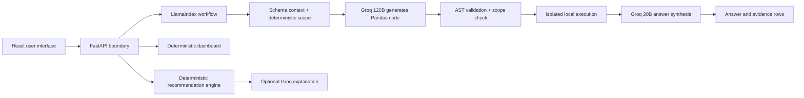
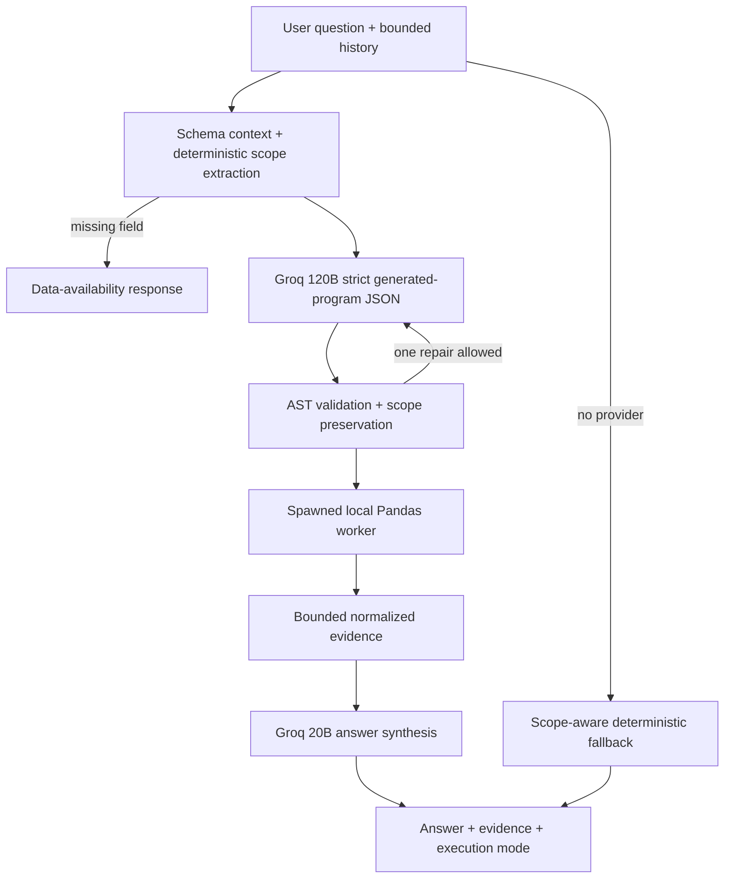

# Architectural Decisions

**Project:** Student Analytics Copilot
**Product name:** Northstar
**Status:** Living decision record
**Last reviewed:** 2026-08-12
**Deployed application:** <https://student-analytics-copilot.onrender.com/>
**Repository:** <https://github.com/Rujul13/student-analytics-copilot>

## 1. Purpose of this document

This file records the important technical and product decisions made while designing and building the Student Analytics Copilot. It explains:

- what was decided;
- why it was selected over the alternatives;
- how the decision helped the delivered application;
- what trade-offs or risks remain;
- what evidence would justify revisiting the decision; and
- which improvements should be implemented next.

This is the architectural source of truth for the **system that is actually deployed**. The original architecture and implementation plans remain useful design history, but where those plans differ from the running code, this document describes the delivered implementation and calls out the difference explicitly.

### Decision status vocabulary

| Status | Meaning |
|---|---|
| Accepted | Implemented and still appropriate for the current product stage. |
| Accepted for demo | Deliberately suitable for the public demonstration, but not sufficient for institutional production. |
| Provisional | Implemented, but should be revisited soon because evidence has exposed a limitation. |
| Deferred | Considered and intentionally postponed. |
| Superseded | Replaced by a later decision. |

## 2. Architectural position

The application follows one governing rule:

> **AI may propose a calculation; only validated local execution and returned evidence make it an answer.**

For natural-language analytics, the 120B model writes a bounded Pandas program, but it cannot execute it. The application checks its AST and requested scope, runs accepted code in an isolated child process, and gives only the normalized result to the 20B answer model. Dashboard metrics and recommendation eligibility remain deterministic; the recommendation model may only rerank verified candidates.

This boundary has produced the best results so far because it combines natural-language usability with deterministic analytics, testability, and visible evidence.

## 3. Current system at a glance

| Concern | Delivered choice | Current status |
|---|---|---|
| Frontend | React, TypeScript, Vite, custom CSS, Lucide icons | Accepted |
| Backend | FastAPI and Pydantic | Accepted |
| Data orchestration | Bounded LlamaIndex Workflow | Accepted |
| Query context | Canonical schema metadata plus deterministic scope extraction | Accepted |
| LLM | Groq using `openai/gpt-oss-120b` for code and `openai/gpt-oss-20b` for answers | Accepted, provider abstraction recommended |
| Analytics | Generated, AST-validated, scope-checked Pandas in a spawned process; deterministic fallback retained | Accepted for demo |
| Default dataset | Reproducible OULAD curated 750-learner cohort | Accepted |
| Recommendation catalog | Authentic OULAD historical modules only | Accepted; supersedes fictional demo catalog |
| Recommendation ranking | Deterministic eligibility and scoring, held-out success baseline, bounded LLM reranking | Provisional pending educator validation |
| Uploaded data | Canonical CSVs, staged and activated atomically per browser session | Accepted for demo |
| Session state | Process memory, 30-minute inactivity TTL, 64-session cap | Accepted for demo |
| Deployment | One Dockerized Render web service | Accepted for demo |
| Delivery control | GitHub Actions tests, frontend build, image build, container smoke test | Accepted, test coverage expansion needed |

## 4. Decision records

### ADR-001 - Use an evidence-first, bounded-AI architecture

**Status:** Superseded for natural-language analytics by ADR-025; retained for dashboard and recommendations

**Context.** Education analytics can influence interventions and course choices. A fluent but incorrect response is more harmful than a limited but auditable answer.

**Decision.** Separate language interpretation from authoritative computation. The model may produce a typed plan or a bounded explanation. Pandas and deterministic recommendation rules produce every numerical result, eligibility decision, score, and ranking.

**Why this decision was taken.** It keeps calculations reproducible, prevents generated-code execution, makes unit testing straightforward, and produces a calculation trace that users can inspect.

**How it helped.** Production testing showed correct results for the completion rate (37.1%), average grade (67.6%), student count (750), and top-module ranking. Each supported response exposed the LlamaIndex, Groq, Pandas, and dataset-version trace. The system also rejected an unrelated weather question without generating code.

**Trade-off.** The application can answer only intents with an implemented executor. Coverage grows more slowly than an unrestricted agent or generated-query system.

**Revisit when.** Revisit the executor catalog, not the trust boundary, when real user questions show repeated unsupported categories.

### ADR-002 - Build around three independent core features

**Status:** Accepted

**Decision.** Keep the dashboard, natural-language analytics, and course recommendations as separate feature paths over a shared `DatasetContext`.

**Why.** Each feature has a different reliability profile:

- the dashboard must be fully deterministic and immediately available;
- natural-language analytics requires bounded interpretation;
- recommendations require eligibility and ranking rules before any explanation.

**How it helped.** A Groq failure cannot take down the dashboard or deterministic recommendations. Each feature can be tested and improved without changing the authority boundary of the others.

**Trade-off.** The current UI exposes these as separate surfaces. The natural-language interface does not yet call the recommendation service, which caused a recommendation question to be rejected during production testing.

**Improvement.** Add typed `student_profile` and `student_recommendation` intents that reuse the existing services rather than duplicating their logic.

### ADR-003 - Use a curated OULAD cohort as the bundled dataset

**Status:** Accepted

**Context.** The assignment called for a Kaggle-style dataset, while the product required linked learners, registrations, courses, assessments, and outcomes.

**Decision.** Use a deterministic cohort derived from the Open University Learning Analytics Dataset. The deployed canonical package contains 750 students, 12 course records including enrichment, 1,548 enrollments, and 1,182 grade records. The transformation uses a fixed seed and records source provenance, DOI, license, source checksum, and dataset version.

**Why.** OULAD provides authentic longitudinal academic relationships rather than a flat synthetic score table. It supports all three product features and can be rebuilt reproducibly.

**How it helped.** One linked dataset powers dashboard metrics, learner risk, module comparisons, individual histories, and recommendation evidence. The version `47871e2e9ece` shown by the production application makes test evidence traceable to a specific cohort.

**Trade-off.** OULAD does not contain real future offerings, degree requirements, course names, or prerequisite structures.

**Alternative considered.** A flat Kaggle student-performance dataset would be simpler, but it would not support realistic multi-table querying or course eligibility. A full institutional dataset would be more realistic but was unavailable and would introduce privacy and governance obligations.

**Reference.** [UCI OULAD dataset](https://archive.ics.uci.edu/dataset/349/open+university+learning+analytics+dataset).

### ADR-004 - Exclude raw virtual-learning-environment clickstream data from v1

**Status:** Accepted

**Decision.** Use `studentInfo`, `studentRegistration`, `courses`, `assessments`, and `studentAssessment`; exclude `studentVle` and `vle` from the first build.

**Why.** The clickstream contains more than ten million interaction records and is not required for the three core features. Excluding it keeps startup time, image size, memory use, and transformation complexity compatible with a small Render service.

**How it helped.** The application loads quickly enough for the public demo and keeps all analytics in process without an analytical database.

**Alternative.** Add offline, pre-aggregated weekly engagement features later. Do not load raw clickstream events into each web-process session.

### ADR-005 - Normalize all data into four canonical tables

**Status:** Accepted

**Decision.** Convert bundled and uploaded data into `students`, `courses`, `enrollments`, and `grades` DataFrames with registered keys and relationships.

**Why.** A stable internal model decouples features from source filenames and prevents the LLM from inventing joins or field semantics.

**How it helped.** Dashboard, querying, and recommendations all consume the same contracts. Imports can be built and validated off to the side, then activated by swapping one `DatasetContext` reference.

**Trade-off.** The current importer accepts only canonical headers. The original plan proposed an interactive mapping layer, but that layer is deferred.

**Improvement.** Add deterministic aliases and a user-confirmed mapping interface. An LLM may suggest unresolved mappings, but deterministic validation and explicit user confirmation must remain authoritative.

### ADR-006 - Separate authentic, derived, and fictional data

**Status:** Accepted for demo

**Decision.** Treat OULAD learner history, grades, module codes, outcomes, and registration evidence as authentic source data. Treat risk bands and weighted summaries as derived analytics. Treat course names, programs, prerequisites, requirements, and future offerings as fictional demo enrichment.

**Why.** OULAD alone cannot support graduation-aware course planning. Fabricating missing institutional structures without disclosure would make recommendations misleading.

**How it helped.** The Course Planning screen visibly states the data boundary and labels the catalog as fictional enrichment. Users can distinguish demonstrated architecture from institutional truth.

**Trade-off.** The recommendations demonstrate the engine, not official academic advice.

**Revisit when.** Replace enrichment with an authenticated institutional catalog, degree-audit feed, and term-offering source before any real deployment.

### ADR-007 - Choose LlamaIndex rather than LangChain for orchestration

**Status:** Accepted

**Decision.** Use LlamaIndex for semantic capability retrieval and workflow events; do not add LangChain.

**Why.** The product is a data-understanding and retrieval system, not a general autonomous-agent platform. LlamaIndex gives the project a data-centric vocabulary and a path for catalog retrieval without introducing a second orchestration framework.

**How it helped.** The implemented workflow is small and inspectable: retrieve capabilities, create a typed plan, and execute a registered operation. Dependencies and failure modes remain limited.

**Alternatives.**

- **LangChain/LangGraph:** stronger fit if the product grows into many tools, long-running agent state, or human approval branches. It currently adds abstraction without a required capability.
- **Direct Groq SDK plus application code:** simpler than LlamaIndex while the catalog contains only three nodes. This is a credible alternative if the semantic catalog remains tiny.

**Revisit when.** Keep LlamaIndex if the catalog expands across heterogeneous schemas, policy documents, metric definitions, and institution-specific metadata. Consider removing it if retrieval remains a three-item lookup with no additional data-indexing needs.

**Reference.** LlamaIndex now directs new orchestration work toward [Workflows rather than the frozen Query Pipeline](https://docs.llamaindex.ai/en/stable/module_guides/querying/pipeline/).

### ADR-008 - Use a bounded Workflow, not an autonomous agent

**Status:** Superseded by ADR-025 for implementation details; the bounded workflow principle remains accepted

**Decision.** Model the known sequence as explicit workflow steps. The deployed analytics workflow retrieves, plans, validates through Pydantic, and executes. It does not let a model choose arbitrary tools in a loop.

**Why.** The required sequence is known. Autonomy would increase latency, cost, nondeterminism, and attack surface without improving the current journeys.

**How it helped.** Every supported query completed through a consistent trace, and the executor never received generated Python, SQL, imports, or function references.

**Difference from the plan.** The final plan described separate route, retrieve, plan, validate, execute, and synthesize stages plus one plan-repair attempt. The delivered workflow combines routing into the typed plan, relies on Pydantic/Groq strict output for validation, uses fixed answer templates, and has no repair step. This smaller design was sufficient for the first vertical slice.

**Improvement.** Add explicit semantic validation and a single bounded repair only when the intent catalog becomes more expressive. Do not add an agent loop.

### ADR-009 - Use BM25 over semantic capability metadata

**Status:** Superseded by ADR-025 for natural-language analytics

**Decision.** Retrieve over small text nodes describing the supported analytics capabilities. Do not embed individual student or grade records.

**Why.** The catalog is small and terminology-focused. BM25 is local, fast, inspectable, and introduces no embedding API, vector database, or model download.

**How it helped.** Capability retrieval worked without another external service and kept raw uploaded rows out of the LLM prompt.

**Alternatives.** Vector retrieval becomes useful when metadata grows, synonyms vary greatly, or different institutions bring heterogeneous schemas. A plain deterministic router may be simpler if the catalog remains extremely small.

**Revisit trigger.** Use a measured retrieval evaluation. Move to hybrid BM25/vector retrieval only if top-k recall on a representative question set falls below the agreed threshold.

### ADR-010 - Use Groq strict structured outputs for planning

**Status:** Superseded by ADR-025; strict structured output remains in use for generated programs and answers

**Decision.** Use Groq with `openai/gpt-oss-20b`, temperature 0 for planning, low reasoning effort, and a strict JSON Schema generated from a Pydantic `AnalyticsPlan`.

**Why.** The existing Groq account provides low-latency inference, and strict structured output prevents free-form plans from crossing the execution boundary.

**How it helped.** Production traces showed validated intents for completion rate, average grade, student count, module ranking, and learner-risk ranking. Limits and sort direction were translated into typed values.

**Trade-offs.** The application constructs the Groq client and LlamaIndex workflow per query, is coupled directly to the Groq SDK, and currently exposes no model-level telemetry.

**Alternatives.** Any provider with reliable JSON Schema output can serve behind an adapter. A small local model may eventually remove external data transfer, but would require latency, reliability, and hosting evaluation.

**Improvements.** Introduce an `AnalyticsPlanner` protocol, construct reusable provider clients at application startup, record latency and failure category without logging question text, and keep the model configurable.

**Reference.** Groq documents that [strict structured outputs use constrained decoding and guarantee schema adherence](https://console.groq.com/docs/structured-outputs).

### ADR-011 - Use allowlisted Pandas executors instead of generated Text-to-Pandas or Text-to-SQL

**Status:** Superseded by ADR-025 for the primary natural-language path; retained as deterministic fallback

**Decision.** Map validated intents to prewritten Pandas operations. Do not use `eval`, `exec`, LlamaIndex's experimental Pandas query engine, or unrestricted generated SQL.

**Why.** The data is already held in DataFrames and fits comfortably in memory. Prewritten operations are deterministic, testable, and safe.

**How it helped.** Independent calculations matched deployed results for core metrics and module rankings. The implementation can expose exactly how a value was produced.

**Trade-off.** Current intent coverage is narrow: headline metrics, risk tables, and module performance. Learner lookup, trends, compound filters, and recommendations are not yet connected to the query interface.

**Alternatives.**

- **Text-to-SQL:** appropriate after moving to a governed relational warehouse with read-only credentials, row-level security, query parsing, cost limits, and an approved semantic layer. It is unnecessary and riskier for the current in-memory CSV demo.
- **DuckDB with registered query templates:** a strong intermediate option for larger CSV/Parquet datasets. DuckDB can query Pandas DataFrames and columnar files directly while retaining SQL and resource controls.
- **Polars:** useful if profiling shows Pandas is the bottleneck, but it does not solve semantic safety by itself.

**References.** [Pandas GroupBy operations](https://pandas.pydata.org/pandas-docs/stable/user_guide/groupby.html) and [DuckDB's Python/DataFrame integration](https://duckdb.org/docs/stable/clients/python/overview).

### ADR-012 - Use FastAPI and Pydantic as the API and validation boundary

**Status:** Accepted

**Decision.** Serve typed HTTP routes with FastAPI, validate request and response models with Pydantic, and keep analytics logic outside route handlers.

**Why.** This matches the Python data stack, supports async Groq calls, provides clear contracts, and keeps malformed model or client data from entering executors.

**How it helped.** Query length, preview tokens, response types, recommendation scores, and plan enums all have explicit constraints. Import failures return controlled errors instead of partially replacing data.

**Improvement.** Introduce `/api/v1` before external clients depend on the API, generate the TypeScript client from OpenAPI, and standardize error envelopes.

### ADR-013 - Use React, TypeScript, Vite, and custom CSS

**Status:** Accepted

**Decision.** Build one responsive React application with TypeScript, Vite, custom CSS, and Lucide icons.

**Why.** It supports fast product iteration, typed API models, and a compact production build.

**How it helped.** The four main journeys share a consistent shell and work at one URL. The current dashboard and recommendation experience were delivered without a large component or charting dependency.

**Difference from the plan.** Tailwind and Recharts were proposed but not adopted. The shipped UI uses custom CSS bars and cards. This reduced dependencies and was sufficient for current visuals.

**Risks and improvements.** `package.json` uses `latest` ranges even though `package-lock.json` captures the installed graph. Replace `latest` with explicit versions, use `npm ci` in the Docker build, add automated accessibility checks, and add browser tests for desktop and mobile behavior.

### ADR-014 - Use deterministic dashboard metric definitions

**Status:** Accepted

**Decision.** Calculate named metrics in application code rather than averaging arbitrary numeric columns or asking an LLM to choose formulas.

**Current definitions.** Completion means `Pass` or `Distinction`; risk uses average grade and withdrawal count; module performance uses mean weighted grade and record count.

**How it helped.** Dashboard values are stable, testable, and available without Groq. Users see dataset identity and version next to the results.

**Trade-off.** These definitions are demo policy, not universal institutional definitions.

**Improvement.** Move thresholds and metric definitions into a versioned semantic registry with plain-language definitions, owner, effective date, and tests. Display definitions in the UI.

### ADR-015 - Use rule-based, transparent course recommendations

**Status:** Provisional

**Decision.** Filter candidates by next-term availability, prior completion, current enrollment, and prerequisite completion. Score eligible candidates using:

- requirement fit: 45%;
- performance fit: 30%;
- progression fit: 25%.

Groq may rerank only the already-eligible top candidate set and write a one-sentence narrative through a strict schema. It cannot add courses, change eligibility, or change deterministic scores. The response records whether hybrid reranking or deterministic fallback produced the displayed order.

**Why.** The available dataset does not support defensible collaborative filtering or a trained success model. A transparent heuristic is appropriate for demonstrating architecture without claiming predictive accuracy.

**How it helped.** Recommendations are personalized by grade, credits, graded-module count, withdrawals, level, program, and course metadata. Each card exposes score components and verified rationale, and the feature still works if Groq fails.

**Evaluated success baseline.** A temporal logistic baseline is trained from prior academic history and evaluated on a student-disjoint held-out set. The bundled local cohort currently reports 62.7% accuracy, ROC AUC 0.653, and Brier score 0.225 over 311 held-out records. Candidate estimates are displayed separately from the deterministic fit score and labeled as non-guaranteed baseline estimates.

**Trade-offs.** The weights are expert-designed demo assumptions, the enrichment is fictional, and the predictive baseline is modest rather than institutionally calibrated. Candidate-specific variation is limited by the available course features. The current `prerequisites_met` field reports required prerequisite codes after eligibility rather than richer completion evidence.

**Alternatives.**

- **Content-based ranking:** suitable once authentic course descriptions, learning outcomes, and student goals are available.
- **Collaborative filtering:** requires much denser course-selection history and careful popularity-bias handling.
- **Learning-to-rank or outcome prediction:** requires a defined target, historical labels, temporal evaluation, calibration, fairness analysis, drift monitoring, and human governance.

**Improvement.** Validate the heuristic with educators and counterfactual tests, document every weight, add an uncertainty/capability indicator, and never deploy the fictional catalog as real guidance.

### ADR-016 - Exclude protected demographic attributes from recommendations

**Status:** Accepted

**Decision.** Do not use gender, region, disability, deprivation band, or age band in ranking.

**Why.** These fields are unnecessary for the demonstrated course-fit logic and create direct fairness and governance risks.

**How it helped.** Recommendations depend on academic evidence and catalog rules only. The UI states that risk is based on performance and withdrawal history, not protected attributes.

**Trade-off.** Excluding attributes from scoring does not prove fairness. They may still be needed in a controlled, aggregate evaluation environment to measure disparate outcomes.

**Improvement.** Build a separate offline fairness report with minimum-group-size rules. Do not expose sensitive group data through the public query interface.

### ADR-017 - Stage and atomically activate uploaded datasets

**Status:** Accepted for demo

**Decision.** Accept exactly four canonical CSV files, validate size, encoding, required columns, row limits, keys, foreign keys, numeric types, and grade ranges; issue a ten-minute preview token; activate all four tables together or none.

**Why.** Partial dataset replacement could mix unrelated students, courses, enrollments, and grades and silently corrupt every feature.

**How it helped.** Failed validation leaves the active dataset untouched. A dataset version fingerprint accompanies the activated context.

**Current limits.** 5 MB per file, 15 MB combined, and table-specific row caps. Uploaded state expires after 30 minutes of inactivity.

**Difference from the plan.** The current importer does not offer column-mapping confirmation and does not use Groq for ambiguous mappings. It intentionally requires canonical templates.

### ADR-018 - Keep uploaded state in memory and isolate it with an opaque cookie

**Status:** Accepted for demo

**Decision.** Use a process-local `SessionStore`, a random HttpOnly cookie, a 30-minute inactivity TTL, least-recently-used eviction, a 64-session cap, and per-session query rate limiting.

**Why.** It avoids accounts and database operations for a public demo and guarantees that uploads disappear when the process restarts.

**How it helped.** The import journey was delivered quickly with atomic per-browser isolation, and the immutable bundled cohort always survives a restart.

**Limitations.** State is not shared across processes or Render instances, is lost on deploy/restart, and cannot support durable audit history. Render's filesystem is ephemeral by default, and horizontally scaled services distribute requests across instances.

**Improvement.** Before scaling beyond one web instance, move session metadata and rate limits to Render Key Value/Valkey and place durable institutional records in Postgres or approved object storage. Do not solve shared state with a persistent disk attached to a horizontally scaled web service.

**References.** [Render ephemeral storage](https://render.com/docs/deploys), [Render scaling behavior](https://render.com/docs/scaling), [Render Key Value](https://render.com/docs/key-value), and [Render Postgres](https://render.com/docs/postgresql).

### ADR-019 - Provide deterministic fallback and graceful degradation

**Status:** Provisional

**Decision.** Keep dashboard and recommendation calculation independent of Groq. If live planning fails, use a small keyword-based safe query catalog.

**Why.** The application should remain useful during provider timeouts, missing configuration, or free-tier service constraints.

**How it helped.** Core metrics can still be answered without an API key, and recommendations remain ranked even if narrative generation fails.

**Defect discovered.** The fallback currently matches phrases without respecting scope. The question “What is Learner 242636's average grade and risk level?” was classified as unsupported by Groq, then the fallback matched “average grade” and returned the cohort average of 67.6%. The learner's actual value was 0% and High risk. This is a semantic correctness failure.

**Required change.** If the structured planner returns `unsupported`, return that result directly. The failure fallback should run only when the planner is unavailable, not when it has explicitly rejected the intent. Scoped entities such as learner IDs must never fall into cohort-level keyword metrics.

### ADR-020 - Expose calculation traces and data provenance

**Status:** Superseded by ADR-025 for calculation traces; dataset provenance and bounded evidence remain accepted

**Decision.** Return a trace with query results and display dataset name, version, source, license, and enrichment boundary in the UI.

**Why.** Trust requires more than a natural-language answer. Users need to know which engine interpreted the question, which deterministic path calculated the result, and which dataset was active.

**How it helped.** The initial production evaluation could distinguish a valid Groq/Pandas route from the faulty deterministic fallback. The trace made the defect diagnosable rather than invisible.

**Improvement.** Add a stable `plan_id`, normalized intent, filters, sort, metric definition, result timestamp, and execution duration to a machine-readable trace. Do not expose hidden model reasoning.

### ADR-021 - Deploy one multi-stage Docker image to one Render service

**Status:** Accepted for demo

**Decision.** Build the Vite frontend in a Node stage, install the Python API in a slim runtime stage, copy the static bundle into FastAPI, run as a non-root user, and serve one origin from Render.

**Why.** One URL avoids CORS and multi-service coordination, reduces deployment configuration, and fits the free-tier demonstration.

**How it helped.** The same image is built and smoke-tested in CI and deployed from a `render.yaml` Blueprint. The browser, API, and cookies share an origin.

**Trade-offs.** Frontend and API cannot scale independently. The free service can sleep, in-memory uploads disappear on restart, and cold starts affect the whole application.

**Alternative.** Split the frontend to a CDN/static service and deploy the API separately when independent scaling, global asset delivery, or stricter network boundaries justify the added complexity.

### ADR-022 - Keep secrets and raw source data out of Git and the frontend

**Status:** Accepted

**Decision.** Store `GROQ_API_KEY` only in local `.env` and Render environment configuration, ignore raw OULAD files, exclude secrets and raw data from the Docker build context, and send only capability metadata or bounded verified evidence to Groq.

**Why.** Public source code and client bundles must never expose provider credentials or uncontrolled student data.

**How it helped.** The repository could be made public safely while Render received the secret separately.

**Improvement.** Add automated secret scanning, dependency vulnerability checks, a formal data-retention statement, and a clear in-product warning not to upload real student PII to the demo.

### ADR-023 - Use GitHub Actions as the deployment quality gate

**Status:** Accepted

**Decision.** On pushes and pull requests, install pinned Python requirements, run backend tests, install the locked frontend graph, compile TypeScript/build Vite, build the Docker image, start the container, and smoke-test the API and root page. Render deploys after checks pass.

**How it helped.** Cross-platform issues were detected and fixed before deployment, and the production packaging path is tested rather than inferred.

**Current evidence.** Eleven backend tests pass. The live browser test found no console warnings or errors during the natural-language evaluation.

**Gaps.** There are no automated browser tests, mocked Groq contract suite, accessibility gate, coverage threshold, container vulnerability scan, or post-deploy smoke test against the Render URL.

### ADR-024 - Keep v1 explicitly out of institutional-production scope

**Status:** Accepted

**Decision.** Do not claim authentication, SSO, durable multi-tenant storage, official degree audit, production student-record retention, or predictive success probabilities.

**Why.** Those capabilities require identity, authorization, privacy impact assessment, data contracts, retention controls, audit logs, and operational ownership that are outside the assignment and demo.

**How it helped.** The build could focus on a credible vertical slice without hiding critical institutional requirements behind demo language.

### ADR-025 - Replace the fixed-capability query router with a genuine CSV/Pandas data agent

**Status:** Accepted on 2026-08-12. This supersedes ADR-001, ADR-008, ADR-009, ADR-010, ADR-011, and the natural-language trace portion of ADR-020. The dashboard and recommendation engine remain deterministic and independent.

**Context.** The assignment explicitly requires a CSV/Pandas Data Agent in which the LLM writes code that executes locally. The former typed intent router could answer only a fixed catalog and could silently discard filters when an unsupported question fell into a broad fallback metric.

**Decision.** `openai/gpt-oss-120b` receives the question, bounded conversation history, metric definitions, table relationships, and schema metadata for the active session. It returns strict JSON containing a short Pandas program against only `students`, `courses`, `enrollments`, and `grades`. Full dataframe rows are not included in the code-generation prompt. The program must assign `result`; an AST validator rejects imports, file/process/network primitives, dunder access, source-frame mutation, unsafe I/O, and unknown names. A separate scope checker verifies exact module codes, presentations, learner IDs, outcomes, requested counts, rate semantics, and ranking direction. Accepted code runs in a fresh `multiprocessing.get_context("spawn")` child with copied frames, restricted builtins, cleared environment, bounded output, and a five-second wall-clock timeout. One repair attempt is allowed. `openai/gpt-oss-20b` then phrases only the normalized result. The API never exposes generated code, prompts, hidden reasoning, or raw exceptions.

**Why.** This satisfies the assignment's core requirement and removes the fixed intent ceiling while preserving an explicit trust boundary between model output and executable work. The larger model is used only for the difficult code-generation step; the smaller model handles inexpensive answer formatting.

**How it helped.** Coverage can extend to compound filters, groupings, rates, comparisons, learner lookups, and conversational follow-ups without adding a handwritten executor for each paraphrase. The response still includes bounded evidence rows and an execution-mode label, so a fluent answer is not the sole artifact users must trust.

**Trade-offs and limitations.** Two provider round trips increase latency and cost, with a third code-generation call on repair. Scope preservation uses deterministic heuristics rather than formal semantic equivalence, so tests and evaluation questions remain essential. Clearing `os.environ` occurs after a spawned interpreter starts and is defense in depth, not OS-level container isolation. POSIX resource limits are unavailable on Windows, where termination relies on the wall-clock timeout. The workflow and Groq client are still constructed per request.

**Alternatives.** LangChain could orchestrate the same stages but would duplicate the selected workflow abstraction. Text-to-SQL becomes preferable after adopting a governed warehouse, read-only roles, a semantic layer, query parsing, and row-level authorization. DuckDB is a credible execution engine when data no longer fits comfortably in Pandas. Prewritten executors remain the fallback for no-key/provider-failure operation, but cannot satisfy the assignment as the primary query architecture.

**Revisit when.** Revisit the validator or scope rules if evaluation finds false rejection or silent scope loss. Do not relax the local execution boundary. Introduce stronger OS/container isolation before using this feature with production institutional data.

**Reference.** `backend/app/pandas_code_validation.py`, `backend/app/pandas_worker.py`, `backend/app/scope_validation.py`, `backend/app/data_agent.py`, and `backend/app/ai_workflow.py`.

## 5. Alternatives and when they become better choices

| Alternative | Why it is not the current choice | When it becomes preferable |
|---|---|---|
| LangChain/LangGraph agents | Too much autonomy and duplicated orchestration for three bounded capabilities | Many tools, durable agent state, approval steps, or complex branching |
| Direct Groq SDK only | Loses the chosen data-retrieval abstraction and future catalog extension | Capability catalog stays tiny and LlamaIndex adds no measurable value |
| Vector database | Extra cost and operations for a three-node metadata catalog | Dozens of heterogeneous schemas/documents and BM25 recall is inadequate |
| Prewritten Pandas executor catalog | Deterministic but fails the assignment's data-agent requirement and caps question coverage | No-key fallback, tightly regulated metrics, or dashboards |
| Open-ended Text-to-SQL | No database is needed today; unrestricted SQL adds safety and cost risks | Governed warehouse, read-only role, semantic model, parser, limits, and audit |
| DuckDB | Additional engine is unnecessary at current data size | Larger CSV/Parquet analytics that exceed comfortable Pandas performance |
| Polars | Migration cost without a measured bottleneck | Profiling shows DataFrame execution is the dominant latency or memory cost |
| Collaborative filtering | OULAD Lite lacks the required dense choice/outcome interactions | Sufficient institutional history plus bias and offline/online evaluation |
| Learning-to-rank | No defensible target labels or governance | Defined outcomes, temporal validation, calibration, fairness, and monitoring |
| Postgres from day one | Operational overhead for an intentionally ephemeral demo | Accounts, durable datasets, audit history, permissions, and multi-instance use |
| Separate frontend/API services | More deployment and CORS complexity | Independent scaling, CDN delivery, or organization-level service ownership |

## 6. Historical evidence from the initial natural-language evaluation

This section records the 2026-08-11 fixed-router build that motivated ADR-025; it does not describe the current data-agent query path.

Production testing on 2026-08-11 produced the following result:

| Capability | Result | Architectural conclusion |
|---|---|---|
| Completion rate | 37.1%, correct | Typed metric planning and deterministic calculation work. |
| Average grade | 67.6%, correct | Cohort aggregate path works. |
| Student count | 750, correct | Metric works; response copy needs improvement. |
| Top three modules | GGG 80.2%, EEE 78.2%, FFF 72.1% | Limit and descending sort are correctly planned. |
| Five lowest-grade high-risk learners | Correct IDs/risk ordering path | UI hides the grades used as ordering evidence. |
| Course recommendation question | Safely rejected | Query catalog is not connected to recommendation service. |
| Learner-specific grade/risk | Incorrect cohort answer | Unsupported-planner and keyword-fallback interaction is unsafe semantically. |
| Off-topic weather question | Safely rejected | Unsupported handling works when no analytics keyword is present. |

The evaluation validates the central bounded-execution decision but shows that **semantic scope validation** is as important as JSON-schema validation.

### Implementation update after the evaluation

The discovered gaps have now produced concrete changes: scoped learner-profile and recommendation intents, distinction counting, a multi-course-failure executor, scope-aware fallback, multi-turn chat history, verified-result synthesis, complete evidence tables, dashboard filters and drill-downs, AI-assisted header mapping with confirmation, bounded recommendation reranking, and the evaluated success baseline. Regression and integration coverage has expanded accordingly.

## 7. Prioritized improvement roadmap

### P0 - correctness before expanding capability

1. **Fix unsupported/fallback semantics.** Distinguish `planner_unavailable` from `planner_returned_unsupported`. Never run keyword fallback after an explicit unsupported plan.
2. **Add entity-scope validation.** Detect learner IDs, module codes, and requested filters; reject any plan that drops a recognized scope.
3. **Add regression tests for the discovered failure.** The named learner query must return either the correct learner profile or a safe unsupported response, never a cohort metric.
4. **Display ranking evidence.** Show average grade, credits, and withdrawals on risk result rows.

### P1 - complete the intended natural-language product

1. Add a typed `student_profile` intent with `student_id` and a deterministic lookup executor.
2. Add a typed `student_recommendation` intent that calls the existing recommendation service.
3. Expand the plan into typed filters, dimensions, metric, sort, and limit without accepting expressions or code.
4. Build an evaluation corpus of at least 50 paraphrased questions covering supported, ambiguous, scoped, adversarial, and unsupported cases.
5. Record route accuracy, execution accuracy, unsupported precision, fallback rate, and p50/p95 latency.
6. Cache the capability retriever and provider client rather than constructing the workflow for every request.

### P1 - improve recommendation credibility

1. Version the scoring policy and expose the weight definitions.
2. Add invariant and counterfactual tests for completion, current enrollment, prerequisites, missing grades, program membership, and withdrawals.
3. Validate ranking behavior with educators; treat weights as provisional until reviewed.
4. Add explicit confidence based on evidence completeness rather than deriving it only from score thresholds.
5. Keep fictional-enrichment disclosure attached to every recommendation export or screenshot.

### P1 - strengthen engineering quality

1. Pin explicit frontend dependency versions and use `npm ci` in Docker.
2. Add Playwright browser tests for all four journeys, responsive layouts, and accessibility.
3. Add mocked Groq contract tests for each plan, timeout, provider error, and malformed/unsupported condition.
4. Add structured event logging for request ID, dataset version, intent, latency, and fallback reason without logging student questions or rows.
5. Add secret scanning, dependency review, and container scanning to CI.

### P2 - improve analytics and import usability

1. Add dashboard filters for module, presentation/term, outcome, and risk.
2. Add trend and filtered-comparison executors with registered metric definitions.
3. Add downloadable results and machine-readable plan/trace metadata.
4. Add a user-confirmed CSV mapping wizard with deterministic aliases.
5. Upgrade from custom bars only if richer interaction, accessibility, or chart types justify a charting library.

### P2 - prepare for multiple instances

1. Move sessions, rate limits, and preview tokens to a shared Key Value service.
2. Store durable dataset metadata and audit records in Postgres.
3. Store approved uploaded files in encrypted object storage with explicit retention and deletion policies.
4. Add authentication, authorization, institutional tenancy, and audit trails before accepting real student data.

### P3 - consider a larger analytics engine or ML

1. Benchmark before replacing Pandas.
2. Introduce DuckDB for controlled analytical templates if datasets move to larger CSV/Parquet collections.
3. Introduce read-only governed SQL only alongside a semantic layer, query parser, row-level access control, statement timeout, row limit, and audit logging.
4. Consider trained recommendation models only after obtaining appropriate historical data, outcome definitions, consent/governance, fairness evaluation, calibration, and drift monitoring.

### ADR-026 - Replace fictional course planning with course-specific OULAD evidence

**Status.** Accepted on 2026-08-11. This supersedes the fictional-catalog portion of ADR-006 and the original recommendation-scoring policy in ADR-009.

**Evidence that triggered the change.** Usability testing showed `NXT` demo courses beside authentic OULAD learners, repeated success probabilities across different candidates, unexplained High/Medium/Low badges, and no clear treatment of learners with little graded evidence. Although disclosures were present, the resulting experience could still be mistaken for real institutional course planning.

**Decision.** The active catalog now contains only authentic OULAD module codes observed in learner histories. Recommendation estimates combine temporal learner evidence with module-specific historical pass rate, withdrawal rate, average grade, sample size, and module identity. The held-out split remains learner-disjoint. Completed and current modules are excluded. Groq may reorder only the exact verified candidates and write explanations from supplied evidence.

**Uncertainty behavior.** Evidence strength is based on the number of graded learner records. Zero or one graded record is `Limited`; two or three is `Moderate`; four or more is `Strong`. Limited-evidence explanations state that the estimate relies mainly on historical module outcomes. Every card exposes module pass rate, withdrawal rate, average grade, record count, and the basis of the estimate.

**Product-language decision.** `OULAD Lite` is renamed in the UI to `OULAD (curated 750-learner cohort)`. `Presentation` is shown as `Term (OULAD presentation)`, with `B` explained as February and `J` as October. Learner risk is labeled `academic-support priority` so it is not confused with course suitability. Natural-language results show bounded evidence and a short execution-mode status rather than generated code or a calculation-trace disclosure.

**Known boundary.** OULAD does not provide future availability, official module titles, prerequisites, degree requirements, or instructor information. The engine therefore recommends historical module fit, not guaranteed enrollment eligibility. A real institution should replace this boundary with its catalog and degree-audit systems.

**Why guardrails remain.** The product no longer leads with adversarial or “safe catalog” wording. Unsupported questions are answered as missing-data or undefined-metric cases. Structural controls validate generated code and isolate its execution because they protect correctness and the application boundary, not because administrators are presumed malicious.

## 8. Current natural-language analytics architecture

JSON Schema validates the model's response shape; it does not prove calculation correctness. The independent AST validator, scope checker, isolated execution boundary, evidence rows, and evaluation corpus together reduce the chance that a well-formed but wrongly scoped program is accepted.

## 9. Decision-review checklist

Review this file when any of the following occurs:

- a new data source or institutional integration is introduced;
- the application begins storing real student data;
- the web service scales beyond one process or instance;
- a new LLM provider or model is selected;
- the query catalog adds an operation, field, join, or entity type;
- recommendation weights, eligibility, or data sources change;
- a new production-evaluation failure is discovered;
- the product adds authentication, roles, exports, or intervention workflows; or
- a benchmark shows that Pandas, BM25, or the single-service deployment is no longer adequate.

For every change, record the decision, evidence, alternatives, consequences, migration plan, and rollback strategy. Architectural decisions should change because evidence changed—not because a new framework became fashionable.

## 10. Reference documents

- `outputs/student-analytics-copilot-architecture-plan.pdf`
- `outputs/student-analytics-copilot-final-implementation-plan.pdf`
- `outputs/natural-language-analytics-test-report.md`
- `README.md`
- `backend/app/ai_workflow.py`
- `backend/app/analytics.py`
- `backend/app/recommendations.py`
- `backend/app/imports.py`
- `backend/app/sessions.py`
- `render.yaml`
- `.github/workflows/ci.yml`

## 11. Final assessment

The current architecture is strong for an assignment-aligned public demonstration. Its most important choices—bounded generated Pandas, structural and semantic validation, isolated local execution, transparent recommendation rules, canonical data, provenance, and graceful degradation—improve coverage without making the model's prose authoritative.

The application does **not** need a more autonomous loop or a vector database next. It needs live-model evaluation across a larger question corpus, stronger semantic verification of generated calculations, calibration analysis for recommendations, educator review, and shared durable infrastructure only when usage and data sensitivity require it.

### ADR-027 - Use full OULAD through a DuckDB/Parquet analytical layer

**Status.** Accepted on 2026-08-12. Supersedes the curated-cohort default in ADR-003.

**Decision.** Build a deployable feature store from the complete official OULAD academic cohort: 28,785 anonymized learners, 32,593 enrollments, and 25,843 graded module histories. DuckDB aggregates the 10.6-million-row VLE clickstream offline and writes Zstandard-compressed Parquet. Runtime startup reads the compact canonical tables through DuckDB and continues to expose Pandas DataFrames to the CSV/Pandas agent.

**Why.** The full cohort strengthens model training and evidence coverage, while Parquet avoids loading or shipping the 432 MB raw clickstream. The database remains embedded and analytical, which fits a single-service assignment deployment better than adding a network database.

**Boundary.** Full OULAD still contains seven anonymized modules and no official degree requirements, prerequisites, module titles, or future offering feed. More rows improve historical-success estimates but do not create graduation awareness.

### ADR-028 - Let AI select three from every verified eligible module

**Status.** Accepted on 2026-08-12. Supersedes the top-three-before-LLM behavior in ADR-026.

**Decision.** Local code evaluates every eligible module, calculates course-specific success and evidence, and sends the complete eligible set to GPT-OSS 120B. The model selects and ranks exactly three. A structured-output validator rejects invented, duplicated, or ineligible course codes. If live selection is unavailable, deterministic scoring returns the top three.

**Why.** OULAD has only seven modules, so a pre-LLM shortlist needlessly prevents a genuine choice. Eligibility and numerical claims remain authoritative local computations while AI performs the multi-factor selection requested by the assignment.

### ADR-029 - Make ingestion flexible while keeping the canonical core strict

**Status.** Accepted on 2026-08-12. Supersedes the exactly-four-files boundary in ADR-017.

**Decision.** Accept one to eight CSV files. Recognize flat academic histories, partial relational packages, four canonical tables, and the five core OULAD tables. Header analysis and source profiling propose normalization; deterministic transformations derive lookup tables and identifiers where meaning is unambiguous. Every accepted dataset is validated and atomically converted into `students`, `courses`, `enrollments`, and `grades` before activation.

**Why.** External education datasets rarely arrive in the application's internal shape. A flexible boundary improves usability without forcing dashboard, query, or recommendation code to handle arbitrary schemas.

**Failure behavior.** Missing labels and identifiers may be derived transparently; academic outcomes or grades are never fabricated silently. The preview reports dashboard, natural-language, historical-recommendation, and graduation-aware capabilities separately.

### ADR-030 - Defer PostgreSQL until durable multi-user state is required

**Status.** Accepted on 2026-08-12.

**Decision.** Use embedded DuckDB for analytical scans, feature construction, Parquet access, and import staging. Retain temporary browser-isolated uploads in memory. Add managed PostgreSQL only when the product needs accounts, durable uploads, shared sessions, audit history, or horizontally scaled API instances.

**Why.** PostgreSQL would not improve the current read-heavy OULAD computations and would add migrations, connections, and another failure domain. Render's free PostgreSQL expires after 30 days, whereas immutable Parquet artifacts deploy with the application.

### ADR-031 - Drive product behavior from a verified semantic capability manifest

**Status.** Accepted on 2026-08-12.

**Decision.** Every `DatasetContext` carries immutable semantic metadata describing the adapter, record grain, analytical dimension, outcome meanings, table descriptions, supported capabilities, and dashboard specification. A registry selects high-confidence known adapters before generic column normalization. DuckDB profiles uploaded tables, while the LLM may propose mappings from bounded metadata; deterministic adapter code remains responsible for transformation and validation. Product consumers do not infer capabilities independently: the dashboard selects tested metrics, filters, labels, and visualizations from the manifest; the Pandas agent receives the same grain and definitions; and recommendation endpoints are unavailable unless individual course history is verified.

**First dedicated adapter.** The Kaggle/UCI Predict Students' Dropout and Academic Success adapter recognizes its 37-column single-file schema. It treats `Course` as one of 17 degree programs, generates session-scoped learner identifiers because the source has none, preserves profile columns, models one aggregate two-semester record per learner, converts 0-20 grades to percentages, and excludes semester grades where no curricular unit was approved. It never constructs fictional individual courses.

**Why.** Renaming arbitrary columns into `students`, `courses`, `enrollments`, and `grades` can create technically valid but semantically false analytics. A capability contract lets heterogeneous datasets change the interface without allowing an LLM to generate new frontend code or invent relationships.

**Verified result.** Against all 4,424 authoritative rows, the adapter recognized 17 programs and 3,748 records with graded evidence; outcomes were 2,209 Graduate, 1,421 Dropout, and 794 Enrolled. Known-answer dashboard results were 63.5% recorded-grade average, 49.9% graduation rate, and 32.1% dropout rate. The course recommender was correctly unavailable.

**Trade-off.** New dataset families require either a dedicated adapter or a confirmed generic mapping. Dynamic behavior is limited to a tested widget and metric registry rather than arbitrary generated dashboards. This costs more engineering per genuinely different grain but prevents silent reinterpretation.

**Next adapters.** Add adapter contracts for learning-management-system assessment exports and linked institutional course catalogs. Add persisted mapping templates after authentication and durable storage are introduced.

The immediate goal is to make every answer correctly scoped, fully evidenced, and impossible to confuse with a broader cohort result—even when the generated program is syntactically valid.
### ADR-032 - Align the product shell to the assignment's two-page layout

**Status.** Accepted on 2026-08-12.

**Decision.** The primary navigation contains exactly two destinations: **Dashboard** and **AI Copilot**. Dashboard owns metrics, filters, visualizations, provenance, priority signals, and a compact dataset-import panel below the analytics. AI Copilot owns two in-page modes: **Ask Your Data** and **Course Recommendations**. The Dashboard priority signal deep-links to Course Recommendations with the High academic-support-priority filter selected.

**Why.** The assignment explicitly requests one dashboard page and one AI Copilot/chat page. Separate Overview, Ask Your Data, Course Planning, and Import Data navigation items made the application appear to be a four-page product and weakened literal rubric alignment.

**Import interaction.** File mapping, validation, capability detection, preview tokens, and atomic activation remain unchanged. Only their presentation is simplified: before selection the Dashboard shows one compact file control; mapping and validation details appear progressively after analysis. The permanent three-step rail, empty canonical-file boxes, capability checklist, and starter-template footer are removed from the user journey.

**How it helped.** All required features remain available while the information architecture now matches the evaluator's requested two-page scaffold. Natural-language analytics and recommendations read as two capabilities of one AI system, and dataset import stays contextual to the dashboard it changes.
