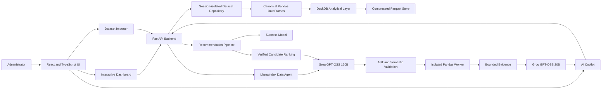
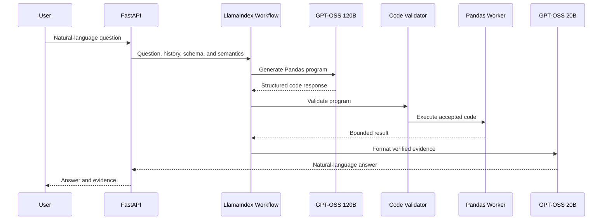

# Northstar: Student Analytics Copilot

Northstar is an AI-powered academic analytics application for exploring student outcomes, querying institutional data in natural language, and producing evidence-based course recommendations.

The application includes two main pages:

- **Dashboard:** Interactive visualizations, filters, outcome analysis, and dataset import
- **AI Copilot:** Natural-language data queries and student-specific course recommendations

## 1. Working Prototype

### Deployed application

[Open the deployed Northstar application](https://student-analytics-copilot.onrender.com)

The application is hosted on Render's free tier. Its first request may take approximately one minute if the service has been inactive.

### Demonstration dataset

The deployed prototype uses the complete anonymized Open University Learning Analytics Dataset (OULAD):

- 28,785 learners
- 32,593 module registrations
- 25,843 aggregated graded histories
- 7 academic modules
- Historical assessment, outcome, demographic, credit, and VLE engagement features

Dataset details:

- Source: UCI Machine Learning Repository
- License: CC BY 4.0
- DOI: 10.24432/C5KK69

The importer also supports single-file and multi-file academic CSV datasets, including the Kaggle and UCI Predict Students' Dropout and Academic Success schema.

## 2. Core Features

### Interactive analytics dashboard

The dashboard provides:

- Student, grade, completion, and academic support metrics
- Module performance comparisons
- Learner outcome distribution
- Module, presentation, and outcome filters
- Clickable visualization drill-downs
- High-priority learner identification
- Dataset-aware labels and visualizations
- CSV dataset import

All displayed metrics are calculated from the active dataset rather than generated by an LLM.

### Natural-language data querying

Administrators can ask questions such as:

- "How many learners earned a distinction?"
- "Which modules have the lowest average grades?"
- "How many learners failed at least two modules?"
- "What is the withdrawal rate for module BBB?"
- "What is the average grade for learners in module CCC?"

The AI Copilot generates Pandas code, validates it, executes it locally against the active dataset, and returns a plain-language answer supported by calculated evidence.

### AI course recommendation engine

The recommendation engine:

1. Loads the selected learner's academic history and profile.
2. Evaluates every eligible module in the active course set.
3. Calculates learner fit, historical success, withdrawal risk, and evidence strength.
4. Produces a course-specific estimated probability of success.
5. Uses the larger AI model to rank three recommendations from the verified candidates.
6. Generates evidence-grounded explanations for each ranking.

The LLM cannot invent modules or change calculated evidence. If the AI service is unavailable, the system returns a deterministic ranking.

## 3. Architecture



### Frontend

The frontend uses React, TypeScript, Vite, Lucide React, and custom responsive CSS. It provides the dashboard, chat, dataset import, learner search, and recommendation workflows.

### Backend

The FastAPI backend provides endpoints for:

- Dataset metadata and dashboard analytics
- Dataset import and activation
- Learner search and course recommendations
- Natural-language questions
- Health and configuration checks

### Analytical storage

DuckDB handles analytical queries and dataset processing. The bundled OULAD dataset is stored as Zstandard-compressed Parquet files and loaded into canonical Pandas DataFrames.

Uploaded datasets are isolated by browser session, held in server memory, and removed after inactivity. They are not currently written to a permanent transactional database.

## 4. Database and Canonical Schema

The semantic adapter normalizes compatible academic data into four canonical tables.

### `students`

| Column | Description |
|---|---|
| `student_id` | Anonymized learner identifier |
| `display_name` | Safe learner display label |
| `program` | Program or academic grouping |
| `highest_education` | Previous education level |
| `previous_attempts` | Number of previous attempts |
| `studied_credits` | Registered study load |

### `courses`

| Column | Description |
|---|---|
| `course_code` | Unique course or module code |
| `course_name` | Display name |
| `department` | Academic department |
| `level` | Course level |
| `credits` | Credit value |
| `offered_next_term` | Known future availability |

### `enrollments`

| Column | Description |
|---|---|
| `enrollment_id` | Unique registration identifier |
| `student_id` | Related learner |
| `course_code` | Related course or module |
| `presentation` | Academic term or presentation |
| `status` | Enrollment status |
| `final_result` | Pass, Fail, Distinction, or Withdrawn |
| `credits` | Registered credits |
| `previous_attempts` | Previous attempts |
| `studied_credits` | Total study load |
| `highest_education` | Education context |
| `vle_total_clicks` | Aggregated historical VLE activity |
| `vle_active_days` | Aggregated active learning days |

### `grades`

| Column | Description |
|---|---|
| `enrollment_id` | Related registration |
| `weighted_grade` | Calculated weighted grade percentage |

This canonical contract allows the dashboard and AI agent to work consistently across compatible datasets.

## 5. How the AI Data Search Works

Northstar uses a bounded LlamaIndex workflow instead of a fixed list of canned queries.



The question is converted directly into Pandas code. Only schema metadata, table descriptions, bounded examples, row counts, and metric definitions are provided to the planning model. Complete uploaded datasets are not sent to Groq.

Generated programs are checked for:

- Unsupported imports
- File or network access
- Dangerous Python operations
- Source DataFrame mutation
- Unknown tables or columns
- Missing question filters
- Invalid aggregation grain
- Unbounded output

Accepted code runs in a short-lived local worker with a timeout and restricted environment. The result is then sent to the smaller formatting model, which may explain the evidence but cannot recalculate it.

One automated repair attempt is allowed after a validation failure. If the application cannot produce a verified result, it reports the failure instead of presenting an unverified number.

## 6. Dataset Import and Semantic Adapter

The importer accepts between one and eight CSV files, including:

- One flat academic-history CSV
- A partial related-table package
- The four canonical Northstar tables
- The five core OULAD CSV files
- Recognized external academic schemas

The import pipeline:

1. Profiles columns, types, null rates, ranges, and representative values with DuckDB.
2. Detects a known adapter when possible.
3. Uses AI-assisted header analysis for unfamiliar schemas.
4. Proposes table and column mappings.
5. Requires confirmation before activation.
6. Applies deterministic transformations.
7. Validates identifiers, relationships, grades, and outcomes.
8. Activates the normalized dataset for the current session.
9. Publishes a capability manifest for the frontend.

The capability manifest allows the interface to adapt to the available data. For example, recommendations are hidden when a dataset contains program-level outcomes but no individual course histories.

## 7. Technology Choices

### React and TypeScript

React supports the dashboard, chat, import, and recommendation workflows. TypeScript helps prevent mismatches between frontend components and API responses.

### FastAPI

FastAPI provides typed validation, automatic API documentation, asynchronous endpoints, and separation between analytics, AI, import, and recommendation services.

### Pandas and LlamaIndex

Pandas supplies the execution environment for generated analytical operations. LlamaIndex orchestrates the workflow between schema context, code generation, validation, execution, and answer formatting.

### DuckDB and Parquet

DuckDB provides fast local analytics and CSV profiling without a separate database server. Parquet reduces the size and load time of the complete OULAD cohort.

### Groq and GPT-OSS

- `openai/gpt-oss-120b` handles Pandas generation and recommendation ranking.
- `openai/gpt-oss-20b` handles answer formatting.

Groq provides hosted inference through an OpenAI-compatible interface.

### Render and Docker

Docker creates a reproducible production environment containing the frontend, backend, processed dataset, and dependencies. Render provides deployment and health checks.

## 8. Source Code Structure

```text
student-analytics-copilot/
├── frontend/
│   └── src/
│       ├── App.tsx
│       ├── api.ts
│       ├── types.ts
│       └── styles.css
├── backend/
│   ├── app/
│   │   ├── main.py
│   │   ├── analytics.py
│   │   ├── data_agent.py
│   │   ├── ai_workflow.py
│   │   ├── pandas_code_validation.py
│   │   ├── pandas_worker.py
│   │   ├── dataset_adapters.py
│   │   ├── analytical_store.py
│   │   ├── recommendations.py
│   │   ├── success_prediction.py
│   │   ├── semantic.py
│   │   └── sessions.py
│   ├── data/
│   ├── scripts/
│   └── tests/
├── DECISIONS.md
├── Dockerfile
├── render.yaml
├── start.ps1
└── README.md
```

Important locations:

- Frontend: `frontend/src`
- Backend: `backend/app`
- Schema: `backend/app/semantic.py` and `backend/app/models.py`
- AI search: `backend/app/ai_workflow.py`, `data_agent.py`, `pandas_code_validation.py`, and `pandas_worker.py`
- Recommendations: `backend/app/recommendations.py` and `success_prediction.py`
- Dataset adapters: `backend/app/dataset_adapters.py`
- Tests: `backend/tests`
- Architectural decisions: `DECISIONS.md`

## 9. Local Setup

### Prerequisites

- Python 3.12
- Node.js 22 or later
- npm
- Git

### Clone the repository

```bash
git clone https://github.com/Rujul13/student-analytics-copilot.git
cd student-analytics-copilot
```

### Configure environment variables

Copy `.env.example` to `.env`.

Windows PowerShell:

```powershell
Copy-Item .env.example .env
```

macOS or Linux:

```bash
cp .env.example .env
```

Add the following values:

```env
GROQ_API_KEY=your_groq_api_key
PANDAS_AGENT_MODEL=openai/gpt-oss-120b
ANSWER_MODEL=openai/gpt-oss-20b
APP_SECRET=replace-with-a-long-random-value
CORS_ORIGINS=http://localhost:5173
ENVIRONMENT=development
```

The Groq API key is required for generated Pandas queries and AI-ranked recommendations. Deterministic dashboard features remain available without it.

Never commit the `.env` file.

### Install backend dependencies

Windows PowerShell:

```powershell
python -m venv .venv
.\.venv\Scripts\Activate.ps1
pip install -r backend\requirements.txt
```

macOS or Linux:

```bash
python3 -m venv .venv
source .venv/bin/activate
pip install -r backend/requirements.txt
```

### Install frontend dependencies

```bash
cd frontend
npm install
cd ..
```

### Start the application

On Windows:

```powershell
.\start.ps1
```

To start the services manually, run the backend:

```bash
cd backend
uvicorn app.main:app --reload --host 127.0.0.1 --port 8000
```

Then run the frontend in another terminal:

```bash
cd frontend
npm run dev
```

Open:

- Application: `http://127.0.0.1:5173`
- API documentation: `http://127.0.0.1:8000/docs`

## 10. Testing

Run backend tests:

```bash
cd backend
pytest
```

Build the production frontend:

```bash
cd frontend
npm run build
```

GitHub Actions runs backend tests, builds the frontend and Docker image, and smoke-tests the production container.

## 11. Deployment

The repository includes a Dockerfile and Render Blueprint.

1. Push the repository to GitHub.
2. Create a Render Blueprint from the repository.
3. Allow Render to read `render.yaml`.
4. Add `GROQ_API_KEY` when prompted.
5. Deploy the service.
6. Confirm the health endpoint succeeds:

```text
https://student-analytics-copilot.onrender.com/api/health
```

## 12. Limitations

- OULAD contains anonymized learner identifiers rather than names or contact information.
- It does not provide official prerequisites, degree requirements, or future module availability.
- Recommendations reflect historical performance and are not authoritative graduation plans.
- Success estimates are predictive baselines, not guarantees or causal conclusions.
- Unrecognized datasets may require administrator confirmation of semantic mappings.
- Uploaded datasets are stored in memory and are lost after server restarts.
- Render's free tier may enter sleep mode after inactivity.
- AI features depend on Groq availability and rate limits.
- Generated code is restricted to approved analytical Pandas operations.

## 13. Future Enhancements

- Persistent PostgreSQL storage for uploaded institutional datasets
- Background processing for substantially larger datasets
- Saved conversations, reports, and exportable dashboards

## 14. Additional Documentation

Detailed architectural decisions, alternatives, trade-offs, and the improvement roadmap are available in [`DECISIONS.md`](DECISIONS.md).
